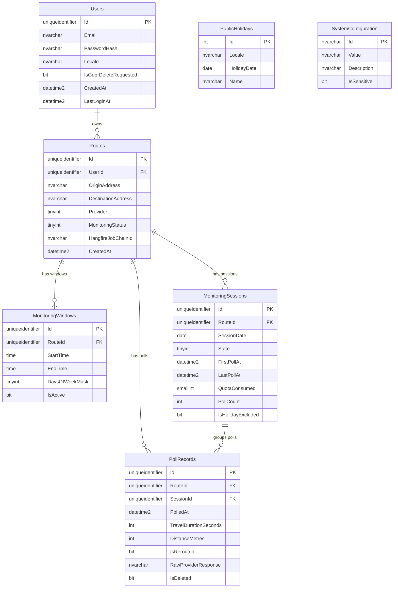

# Data Model: PoTraffic — Empirical Commute Volatility Engine

**Feature Branch**: `00001-potraffic-core`
**Created**: 2026-02-19
**Status**: Draft

---

## 1. Overview

The PoTraffic schema captures the full lifecycle of user-defined route monitoring: from user identity and route configuration, through time-windowed polling sessions, to individual poll records and system-wide configuration keys.  
The entity graph is user-centric — every operational table cascades from `Users` — with `PollRecords` as the high-volume leaf table that feeds both the real-time volatility chart and the STDDEV-based historical baseline projection.  
Hangfire's persistence tables live in a separate `hangfire` schema managed entirely by the Hangfire bootstrap; they are **not** mapped by EF Core and are documented here for schema-awareness only.

---

## 2. Entity Definitions

### 2.1 `Users`

Stores application identity, locale (for holiday exclusion), and GDPR lifecycle state.

| Column | SQL Type | Nullable | Constraints | Notes |
|---|---|---|---|---|
| `Id` | `uniqueidentifier` | NO | PK, DEFAULT `NEWSEQUENTIALID()` | Sequential GUIDs reduce page fragmentation |
| `Email` | `nvarchar(320)` | NO | UNIQUE | RFC 5321 maximum length |
| `PasswordHash` | `nvarchar(512)` | NO | — | BCrypt hash; never raw password |
| `Locale` | `nvarchar(64)` | NO | — | IANA timezone string, e.g. `Europe/London` |
| `IsGdprDeleteRequested` | `bit` | NO | DEFAULT `0` | Set to `1` to queue hard-delete job |
| `CreatedAt` | `datetime2` | NO | DEFAULT `GETUTCDATE()` | UTC |
| `LastLoginAt` | `datetime2` | YES | — | Updated on each successful auth; NULL until first login |

**Indexes**:
- `UX_Users_Email` — unique, clustered candidate on `Email` (non-clustered; PK is clustered).

---

### 2.2 `Routes`

One row per user-defined origin-to-destination pairing. Holds the Hangfire chain anchor for the recursive polling job.

| Column | SQL Type | Nullable | Constraints | Notes |
|---|---|---|---|---|
| `Id` | `uniqueidentifier` | NO | PK, DEFAULT `NEWSEQUENTIALID()` | — |
| `UserId` | `uniqueidentifier` | NO | FK → `Users.Id` ON DELETE CASCADE | — |
| `OriginAddress` | `nvarchar(500)` | NO | — | Provider-verified, standardised form |
| `DestinationAddress` | `nvarchar(500)` | NO | — | Provider-verified, standardised form |
| `Provider` | `tinyint` | NO | — | Enum: `0 = GoogleMaps`, `1 = TomTom`; stored as byte |
| `MonitoringStatus` | `tinyint` | NO | DEFAULT `0` | Enum: `0 = Active`, `1 = Paused`, `2 = Deleted` |
| `HangfireJobChainId` | `nvarchar(100)` | YES | — | Job ID returned by `BackgroundJob.Schedule`; NULL when no active chain |
| `CreatedAt` | `datetime2` | NO | DEFAULT `GETUTCDATE()` | UTC |

**Foreign Keys**:
- `FK_Routes_Users` → `Users.Id` CASCADE DELETE (schema-enforced GDPR cascade).

**Indexes**:
- `IX_Routes_UserId` — non-clustered on `(UserId, MonitoringStatus)` — supports "all active routes for user" queries.

---

### 2.3 `MonitoringWindows`

Defines the recurring time-of-day window(s) during which a route is polled. One route may have multiple windows (e.g., AM and PM commutes).

| Column | SQL Type | Nullable | Constraints | Notes |
|---|---|---|---|---|
| `Id` | `uniqueidentifier` | NO | PK, DEFAULT `NEWSEQUENTIALID()` | — |
| `RouteId` | `uniqueidentifier` | NO | FK → `Routes.Id` ON DELETE CASCADE | — |
| `StartTime` | `time(0)` | NO | — | Time-of-day, second precision; local semantics resolved via `Users.Locale` |
| `EndTime` | `time(0)` | NO | — | Must be > `StartTime`; enforced at application layer |
| `DaysOfWeekMask` | `tinyint` | NO | — | Bitmask: bit 0 = Monday … bit 6 = Sunday (ISO week day order) |
| `IsActive` | `bit` | NO | DEFAULT `1` | Soft-disable without deleting window definition |

**Foreign Keys**:
- `FK_MonitoringWindows_Routes` → `Routes.Id` CASCADE DELETE.

**Indexes**:
- `IX_MonitoringWindows_RouteId` — non-clustered on `RouteId`.

**Notes**:
- `DaysOfWeekMask` bitmask example: weekdays only = `0b0011111` = `31`; every day = `0b1111111` = `127`.
- Application layer (not DB constraint) validates `EndTime > StartTime` and that the mask has at least one bit set.

---

### 2.4 `MonitoringSessions`

One row per calendar day per route when a monitoring window fires. Acts as session envelope for grouping `PollRecords` and tracking the per-session quota consumed.

| Column | SQL Type | Nullable | Constraints | Notes |
|---|---|---|---|---|
| `Id` | `uniqueidentifier` | NO | PK, DEFAULT `NEWSEQUENTIALID()` | — |
| `RouteId` | `uniqueidentifier` | NO | FK → `Routes.Id` ON DELETE CASCADE | — |
| `SessionDate` | `date` | NO | — | UTC midnight of the polling day; used for same-weekday baseline grouping |
| `State` | `tinyint` | NO | DEFAULT `0` | Enum: `0 = Pending`, `1 = Active`, `2 = Completed` |
| `FirstPollAt` | `datetime2` | YES | — | UTC; set on first successful poll |
| `LastPollAt` | `datetime2` | YES | — | UTC; updated on every successful poll |
| `QuotaConsumed` | `smallint` | NO | DEFAULT `0` | Incremented once on session start (FR-003) |
| `PollCount` | `int` | NO | DEFAULT `0` | Running count of successful polls in this session |
| `IsHolidayExcluded` | `bit` | NO | DEFAULT `0` | Set to `1` if `SessionDate` is a public holiday for the user's locale (FR-021) |

**Foreign Keys**:
- `FK_MonitoringSessions_Routes` → `Routes.Id` CASCADE DELETE.

**Indexes**:
- `IX_MonitoringSessions_RouteId_SessionDate` — non-clustered unique on `(RouteId, SessionDate)` — one session per route per day.
- `IX_MonitoringSessions_SessionDate` — non-clustered on `SessionDate` — supports nightly maintenance and baseline weekday queries.

**Notes**:
- `QuotaConsumed` is checked against `SystemConfiguration["quota.daily.default"]` before `State` is advanced to `Active`. If quota is exceeded, `State` stays `Pending` and the session is skipped.
- `IsHolidayExcluded` sessions are omitted from the STDDEV baseline query (FR-021).

---

### 2.5 `PollRecords`

High-volume leaf table. One row per five-minute polling attempt. The reroute flag is set by application logic immediately on insert.

| Column | SQL Type | Nullable | Constraints | Notes |
|---|---|---|---|---|
| `Id` | `uniqueidentifier` | NO | PK, DEFAULT `NEWSEQUENTIALID()` | — |
| `RouteId` | `uniqueidentifier` | NO | FK → `Routes.Id` ON DELETE CASCADE | Denormalised for direct route-level queries without session join |
| `SessionId` | `uniqueidentifier` | YES | FK → `MonitoringSessions.Id` SET NULL | Nullable: "Check Now" ad-hoc polls have no session |
| `PolledAt` | `datetime2` | NO | — | UTC; exact provider call timestamp |
| `TravelDurationSeconds` | `int` | NO | — | Raw provider value; never NULL on successful poll |
| `DistanceMetres` | `int` | NO | — | Raw provider value |
| `IsRerouted` | `bit` | NO | DEFAULT `0` | Set to `1` when detection rule fires (see §4, Decision 2) |
| `RawProviderResponse` | `nvarchar(max)` | YES | — | Full JSON response; stored for audit/debugging; subject to 90-day pruning |
| `IsDeleted` | `bit` | NO | DEFAULT `0` | Soft-delete flag for 90-day rolling pruning (FR-019); use global query filter |

**Foreign Keys**:
- `FK_PollRecords_Routes` → `Routes.Id` CASCADE DELETE.
- `FK_PollRecords_Sessions` → `MonitoringSessions.Id` SET NULL (ad-hoc polls must not orphan).

**Indexes**:
- `IX_PollRecords_RouteId_PolledAt` — non-clustered on `(RouteId, PolledAt DESC)` — primary query pattern for baseline and charting.
- `IX_PollRecords_SessionId` — non-clustered on `SessionId` — session-level aggregation.
- `IX_PollRecords_PolledAt` — non-clustered on `PolledAt` — nightly pruning scan (FR-019).

**Notes**:
- `RawProviderResponse` is excluded from the baseline STDDEV query to avoid needless I/O; project only `TravelDurationSeconds`, `DistanceMetres`, `PolledAt`, `IsRerouted`.
- Reroute detection rule (FR-006): `DistanceMetres` ≥ 15% above the prior reading **and** two consecutive readings match. Evaluated in the MediatR handler on insert, not by a DB trigger.
- Ad-hoc "Check Now" polls (US-3/FR-004) have `SessionId = NULL` and are never counted against quota.

---

### 2.6 `PublicHolidays`

Locale-keyed holiday calendar used to set `MonitoringSessions.IsHolidayExcluded` (FR-021). Populated by a data-seed or annual maintenance job; not user-editable.

| Column | SQL Type | Nullable | Constraints | Notes |
|---|---|---|---|---|
| `Id` | `int` | NO | PK, IDENTITY(1,1) | Surrogate int PK; volume is small |
| `Locale` | `nvarchar(64)` | NO | — | Matches `Users.Locale` IANA string |
| `HolidayDate` | `date` | NO | — | Calendar date of the public holiday |
| `Name` | `nvarchar(200)` | NO | — | Human-readable name; informational only |

**Indexes**:
- `UX_PublicHolidays_Locale_Date` — unique non-clustered on `(Locale, HolidayDate)` — lookup on session-start check.

**Notes**:
- Not FK-linked to `Users`; join is performed by matching `Locale` string equality.
- Holiday seeding strategy (annual batch vs. third-party API fetch) is a deployment concern, not a schema concern.

---

### 2.7 `SystemConfiguration`

Key-value store for operator-managed runtime settings. Used for per-provider cost rates, daily quota ceiling, and quota-reset time (FR-003, FR-023).

| Column | SQL Type | Nullable | Constraints | Notes |
|---|---|---|---|---|
| `Id` | `nvarchar(100)` | NO | PK | String key, e.g. `cost.perpoll.googlemaps` |
| `Value` | `nvarchar(500)` | NO | — | String-encoded; parsed to numeric/TimeSpan at application layer |
| `Description` | `nvarchar(1000)` | YES | — | Human-readable purpose; displayed on /Diag page |
| `IsSensitive` | `bit` | NO | DEFAULT `0` | If `1`, value is masked on /Diag page (FR-Admin-3) |

**Seed Rows** (applied via EF Core `HasData`):

| `Id` | `Value` | `Description` | `IsSensitive` |
|---|---|---|---|
| `cost.perpoll.googlemaps` | `0.005` | Cost in USD per Google Maps Directions API call | `0` |
| `cost.perpoll.tomtom` | `0.0045` | Cost in USD per TomTom Routing API call | `0` |
| `quota.daily.default` | `10` | Maximum monitoring sessions per user per UTC day | `0` |
| `quota.reset.utc` | `00:00` | UTC time at which daily quota resets (fixed) | `0` |

**Notes**:
- No FK relationships; consumed read-only by application services.
- Numeric coercion (`decimal.Parse`, `int.Parse`) is performed at the service layer during application startup and cached via `IOptions<T>` or `IMemoryCache`.

---

## 3. Relationships Diagram

---

## 4. Key Design Decisions

1. **GDPR cascade delete is schema-enforced, not application-level.**  
   `Routes.UserId` carries `ON DELETE CASCADE`, which propagates to `MonitoringSessions`, `MonitoringWindows`, and `PollRecords` via their own cascade FKs. When `Users.IsGdprDeleteRequested = 1`, a hard-delete job issues a single `DELETE FROM Users WHERE Id = @id`; the database engine removes all descendant rows atomically. No application-layer loop is needed, eliminating the risk of partial deletion across a transaction boundary.

2. **Reroute detection (FR-006) is a two-consecutive-reading rule evaluated in application code, not a database trigger.**  
   On each `PollRecord` insert, the MediatR handler loads the two most recent prior `PollRecords` for the same `RouteId` and `SessionId`. If both the new record and its immediate predecessor have `DistanceMetres ≥ 115%` of the record before them, `IsRerouted = 1` is set on the new record and the predecessor is updated. The prior-record comparison window is intentionally session-scoped to avoid cross-session distance drift false positives.

3. **STDDEV baseline aggregation is executed entirely in Azure SQL via `SqlQueryRaw<BaselineSlotDto>`, not LINQ.**  
   EF Core's LINQ translator (including EF Core 10) does not emit `STDEV()`. Materialising raw rows for in-process σ calculation would allocate O(N) memory per user. The parameterised raw SQL query (see §6) runs a single grouped aggregation at the database, returning one `BaselineSlotDto` row per five-minute time bucket per day-of-week. All `SqlQueryRaw` inputs are passed as `SqlParameter` — never string-concatenated.

4. **`MonitoringSessions.QuotaConsumed` is incremented once at session activation, not per-poll.**  
   The daily quota ceiling (`SystemConfiguration["quota.daily.default"]`) limits the number of *sessions* opened per user per UTC day, not individual polls. A session is counted against quota when its `State` advances from `Pending` → `Active`. Quota resets at `00:00 UTC` (FR-003) via a Hangfire `RecurringJob` that sets `QuotaConsumed = 0` across all sessions with `SessionDate = CAST(GETUTCDATE() - 1 AS date)`.

5. **Holiday exclusion is stored as a flag on `MonitoringSessions`, not a join-at-query-time check.**  
   `MonitoringSessions.IsHolidayExcluded` is set once on session creation by checking `PublicHolidays` for the user's `Locale` and `SessionDate`. Storing the result denormalised on the session row means the baseline STDDEV query can filter excluded sessions with a simple `WHERE IsHolidayExcluded = 0` predicate, avoiding a join against `PublicHolidays` (and a `Users` join for locale) on every baseline read. The `PublicHolidays` table is locale-indexed and append-only.

6. **Hangfire schema isolation — `hangfire` schema, no EF Core mapping.**  
   Hangfire's `UseHangfireSqlServerStorage` call creates and manages its own tables under the `hangfire` schema in the same database. EF Core migrations are scoped to the `dbo` schema and must never overlap. The `HangfireJobChainId` string on `Routes` is a soft reference (string foreign key to Hangfire's `Id` column) — it is never mapped as an EF FK to avoid a cross-schema constraint that would complicate schema migrations.

7. **`PollRecords.IsDeleted` global query filter for 90-day rolling pruning (FR-019).**  
   Rather than issuing hard deletes during business hours, the nightly maintenance Hangfire job soft-deletes records by setting `IsDeleted = 1` for all rows with `PolledAt < GETUTCDATE() - 90`. A weekly hard-delete job then physically removes `IsDeleted = 1` rows during a low-traffic window. EF Core's global query filter (`HasQueryFilter(p => !p.IsDeleted)`) ensures application code never reads deleted records without opting in. `RawProviderResponse` is nulled out at 90 days regardless, even if the top-level row survives for aggregate purposes.

8. **Provider and MonitoringStatus are stored as `tinyint` enums, not lookup tables.**  
   Provider count is small (2–4 values), change frequency is near zero, and join elimination on high-volume `PollRecords` queries is worth the schema flexibility trade-off. Enum-to-`tinyint` value conversion is defined in EF Core fluent configuration using `HasConversion<int>()`.

9. **Sequential GUIDs (`NEWSEQUENTIALID()`) as PKs to reduce B-tree fragmentation.**  
   `PollRecords` is the highest-write table. Random GUIDs (`NEWID()`) cause ~99% page fragmentation under insert load. `NEWSEQUENTIALID()` generates GUIDs that are monotonically increasing per server restart, giving clustered-index insert behaviour close to `IDENTITY(1,1)` without exposing sequential integers in public API identifiers.

10. **`MonitoringWindows.DaysOfWeekMask` bitmask over a separate junction table.**  
    A junction table (`RouteWindowDays`) would require 1–7 extra rows per window and a GROUP BY on every window load. The bitmask encodes the same information in one byte. Day-of-week extraction for scheduling is performed in application code (`(mask >> dayIndex) & 1`), not in SQL predicates, so a junction table's indexed lookup advantage is irrelevant.

---

## 5. EF Core Notes

The following describes the **intent** of each non-trivial EF Core mapping. Exact fluent API syntax belongs in the implementation; this section specifies *what* the mapping must achieve.

### 5.1 `Provider` enum — value conversion
Map `Route.Provider` (C# enum `TrafficProvider`) to `tinyint` column via `HasConversion<int>()` (or `HasConversion<byte>()`). The stored integer must match the enum's declared values exactly — do not rely on implicit ordering. The same conversion applies to `Route.MonitoringStatus` (`RouteStatus` enum) and `MonitoringSession.State` (`SessionState` enum).

### 5.2 `PollRecords` global query filter
Apply `HasQueryFilter(p => !p.IsDeleted)` on the `PollRecord` entity. All queries issued through `DbContext` will automatically exclude soft-deleted records. The nightly pruning job and the weekly hard-delete job must call `IgnoreQueryFilters()` to bypass this filter when operating on the deleted set.

### 5.3 `MonitoringWindows.DaysOfWeekMask` — no special mapping required
`tinyint` maps directly to `byte` in C#. The bitmask interpretation is handled by a domain method on the `MonitoringWindow` entity or a static helper; no EF value conversion is needed.

### 5.4 `MonitoringSessions.SessionDate` — `DateOnly` mapping
Map `SessionDate` (`date` SQL column) to `DateOnly` (C# value) via `HasColumnType("date")`. EF Core 8+ supports `DateOnly` natively without a custom value converter on Azure SQL.

### 5.5 `MonitoringWindows.StartTime` / `EndTime` — `TimeOnly` mapping
Map `time(0)` SQL columns to `TimeOnly` (C#) via `HasColumnType("time(0)")`. EF Core 8+ supports `TimeOnly` natively.

### 5.6 `SystemConfiguration` — string PK
`SystemConfiguration.Id` is a natural string key. Configure with `HasKey(s => s.Id)` and `Property(s => s.Id).HasMaxLength(100).IsRequired()`. No `NEWSEQUENTIALID()` default needed.

### 5.7 `PublicHolidays` — `int IDENTITY` PK
Use `UseIdentityColumn()` on the `Id` property. Volume is small; sequential integer PK is appropriate and avoids GUID overhead for this table.

### 5.8 `PollRecords.SessionId` — nullable FK with SET NULL
Configure `HasOne(p => p.Session).WithMany(s => s.PollRecords).HasForeignKey(p => p.SessionId).OnDelete(DeleteBehavior.SetNull)`. This allows "Check Now" poll records (`SessionId = null`) to coexist with session-bound records without a discriminator column.

### 5.9 Schema scoping for migrations
All EF Core entities are in the `dbo` schema (default). Configure `HasDefaultSchema("dbo")` on `ModelBuilder` if the project's database defaults differ. Never set `hangfire` as a default schema — that schema is exclusively Hangfire-owned.

### 5.10 `RawProviderResponse` — column type and size hint
Configure `Property(p => p.RawProviderResponse).HasColumnType("nvarchar(max)")`. Do not apply `HasMaxLength()` with an integer limit — Azure SQL `nvarchar(max)` is required for large provider payloads. EF Core will not add a length constraint.

### 5.11 Seed data for `SystemConfiguration`
Apply seed rows via `entity.HasData(...)` in `OnModelCreating`. Seed data must exactly match the rows in §2.7. Migrations will include `INSERT` statements for these rows; re-running migrations against an existing database will be a no-op due to PK uniqueness.

---

## 6. Read Projections

### 6.1 `BaselineSlotDto`

A read-only projection DTO returned by `SqlQueryRaw<BaselineSlotDto>`. It is **not** an EF Core entity — it has no `DbSet<T>` — but it must be registered via `HasNoKey()` on `ModelBuilder` for `SqlQueryRaw<T>` to function.

**Projected shape**:

| Property | C# Type | SQL Expression | Notes |
|---|---|---|---|
| `DayOfWeek` | `int` | `DATEPART(dw, PolledAt)` | 1 = Sunday … 7 = Saturday (SQL Server convention); normalise to ISO in application |
| `SlotMinute` | `int` | `(DATEPART(hh, PolledAt) * 60) + (DATEPART(mi, PolledAt) / 5 * 5)` | Minutes since midnight, rounded down to 5-min bucket |
| `MeanDurationSeconds` | `double` | `AVG(CAST(TravelDurationSeconds AS float))` | Null-safe; aggregation will never return NULL for groups with ≥1 row |
| `StdDevDurationSeconds` | `double?` | `STDEV(CAST(TravelDurationSeconds AS float))` | Returns `NULL` for groups with < 2 rows — treat as "insufficient data" |
| `SampleCount` | `int` | `COUNT(*)` | Used by the application to enforce the FR-012 minimum of 3 sessions |

### 6.2 Baseline SQL Query Shape

The parameterised query must:

1. **Filter** to rows where:
   - `RouteId = @routeId`
   - `IsDeleted = 0`
   - `SessionId IS NOT NULL` (exclude "Check Now" ad-hoc polls)
   - The parent `MonitoringSessions.IsHolidayExcluded = 0` (JOIN required)
   - `PolledAt >= DATEADD(day, -90, GETUTCDATE())` (rolling 90-day window; FR-019)

2. **Group by** `(DATEPART(dw, PolledAt), SlotMinute)` where `SlotMinute` is the derived 5-minute bucket expression.

3. **Aggregate** `AVG(duration)`, `STDEV(duration)`, `COUNT(*)` per group.

4. **Filter groups** with `HAVING COUNT(DISTINCT CAST(CAST(PolledAt AS date) AS nvarchar)) >= 3` — ensuring at least 3 distinct calendar days (proxy for 3 sessions) contribute to each slot's statistics before the slot is returned (FR-012).

5. Return only columns matching `BaselineSlotDto` property names exactly (EF Core column-name matching is case-insensitive but exact-name mapping avoids runtime errors).

All literals that vary by request (`@routeId`, the 90-day date boundary if pre-computed) **must** be passed as `SqlParameter` objects. No string interpolation into the query text.

### 6.3 Daily Usage Projection (Admin — US-5)

A second raw-SQL projection `UserDailyUsageDto` supports the Admin usage table (FR-Admin-1):

| Property | C# Type | SQL Expression | Notes |
|---|---|---|---|
| `UserId` | `Guid` | `u.Id` | — |
| `Email` | `string` | `u.Email` | — |
| `TodayPollCount` | `int` | `COUNT(pr.Id)` | Polls from sessions with `SessionDate = CAST(GETUTCDATE() AS date)` |
| `EstimatedCostUsd` | `decimal` | Computed in application from `TodayPollCount × cost-per-poll` rate | Join to `SystemConfiguration` done in application, not SQL |

This projection joins `Users` → `Routes` → `MonitoringSessions` → `PollRecords`, filtered to today's UTC date. It is a GROUP BY query on `(u.Id, u.Email)` and is also registered via `HasNoKey()`.

---

*End of data-model.md*
