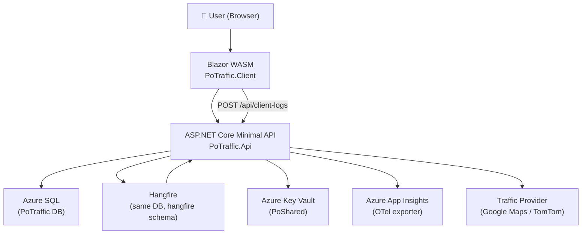
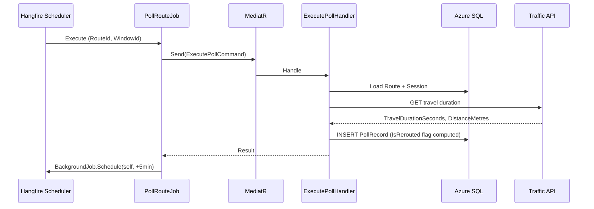

# Implementation Plan: PoTraffic — Empirical Commute Volatility Engine

**Branch**: `00001-potraffic-core` | **Date**: 2026-02-19 | **Spec**: [spec.md](spec.md)  
**Input**: Feature specification from `specs/00001-potraffic-core/spec.md`

---

## Summary

PoTraffic is an empirical commute volatility monitoring engine. It polls a user-configured route on a five-minute schedule during active monitoring windows, builds a statistical baseline (Mean ± 1σ) from accumulated same-weekday sessions, and presents the data as a dual-series chart with an Optimal Departure Window. The technical approach is: a recursive Hangfire job chain (one chain per active route) dispatching MediatR commands, persisted via EF Core to Azure SQL, with a Blazor WASM frontend served from the same Azure App Service as the API.

---

## Technical Context

**Language/Version**: C# 14 / .NET 10 (LTS) — back-end and front-end  
**Primary Dependencies**:
- Back-end: ASP.NET Core Minimal API 10, MediatR 12, FluentValidation 11, EF Core 10, Hangfire 1.8, Serilog 4, Azure.Identity 1.12, OpenTelemetry .NET
- Front-end: Blazor WebAssembly .NET 10, Radzen.Blazor (latest stable)
- Testing: xUnit 2.9, NSubstitute 5, testcontainers-dotnet **3.x** (not 4.x), Playwright .NET C# 1.44+

**Storage**: Azure SQL (prod), Azure SQL Edge (ARM64, local/test via Docker)  
**Testing**: xUnit + NSubstitute (unit), xUnit + Testcontainers + `WebApplicationFactory<T>` (integration), Playwright .NET C# (E2E)  
**Target Platform**: Azure App Service (Linux); Blazor WASM in browser (modern desktop, 1280px+ primary)  
**Project Type**: Web (API + Blazor WASM)  
**Performance Goals**: API p95 < 500ms for all user-facing endpoints; baseline query (STDDEV aggregation) < 200ms  
**Constraints**: Daily quota per user (configurable, default 10 sessions); poll interval ≥5 minutes; GDPR hard-delete on demand; baseline withheld until 3+ same-weekday sessions accumulated  
**Scale/Scope**: Single-region, single Azure App Service instance; up to ~1,000 concurrent monitored routes at MVP

**Tech Context Document**: [`docs/tech-context.md`](../../docs/tech-context.md) — registered baseline; supersedes any inline conflict.

---

## Instructions Check

**Gate status**: ✅ PASS (with justified complexity items logged in Complexity Tracking)

| Principle | Status | Notes |
|---|---|---|
| **I. Zero-Waste** | ✅ PASS | No dead code paths introduced; test-only endpoints are environment-gated, not commented out |
| **II. SOLID & GoF** | ✅ PASS | Strategy pattern for provider abstraction; Chain of Responsibility for `DefaultAzureCredential`; Factory for test endpoint registration; SRP enforced by thin Hangfire dispatcher + MediatR handler split |
| **III. Test Coverage** | ✅ PASS | All three test layers mandated (unit, integration, E2E); each user story has associated test scenarios; Red-Green-Refactor cycle enforced |
| **IV. VSA** | ✅ PASS | Features sliced by user story under `Features/<Name>/`; shared infrastructure in `Infrastructure/`; no horizontal service/repository root folders |
| **V. Fixed Stack** | ✅ PASS (v1.1.0) | Hangfire approved as MINOR amendment; Serilog clarified as MEL backend; Playwright confirmed as .NET C# |

**Pre-plan audit**: 2 FAIL violations identified and resolved before plan was authored:
1. TypeScript Playwright → replaced with Playwright .NET C# (stack compliance)
2. Hangfire not in locked stack → MINOR amendment v1.1.0 filed 2026-02-19

---

## Project Structure

### Documentation (this feature)

```text
specs/00001-potraffic-core/
├── plan.md              ← this file
├── spec.md              ← feature specification (32 FRs, 10 SCs)
├── research.md          ← technical stack research (10 topics)
├── data-model.md        ← entity definitions, ER diagram, EF Core notes
├── quickstart.md        ← local dev setup + 5 integration scenarios
├── contracts/           ← API contracts per slice (7 files)
│   ├── index.md
│   ├── auth.md
│   ├── routes.md
│   ├── history.md
│   ├── admin.md
│   ├── account.md
│   └── system.md
└── tasks.md             ← Phase 2 output (@sddp.tasks — NOT created here)
```

### Source Code (repository root)

```text
PoTraffic.sln

src/
├── PoTraffic.Api/
│   ├── Features/
│   │   ├── Auth/
│   │   │   ├── RegisterCommand.cs + Handler + Validator
│   │   │   ├── LoginCommand.cs + Handler + Validator
│   │   │   ├── RefreshTokenCommand.cs + Handler
│   │   │   └── AuthEndpoints.cs
│   │   ├── Routes/
│   │   │   ├── CreateRouteCommand.cs + Handler + Validator
│   │   │   ├── UpdateRouteCommand.cs + Handler + Validator
│   │   │   ├── DeleteRouteCommand.cs + Handler
│   │   │   ├── GetRoutesQuery.cs + Handler
│   │   │   ├── PollRouteJob.cs              (Hangfire dispatcher — thin)
│   │   │   ├── ExecutePollCommand.cs + Handler
│   │   │   └── RoutesEndpoints.cs
│   │   ├── MonitoringWindows/
│   │   │   ├── CreateWindowCommand.cs + Handler + Validator
│   │   │   ├── StartWindowCommand.cs + Handler
│   │   │   ├── StopWindowCommand.cs + Handler
│   │   │   └── WindowsEndpoints.cs
│   │   ├── History/
│   │   │   ├── GetPollHistoryQuery.cs + Handler
│   │   │   ├── GetBaselineQuery.cs + Handler   (uses SqlQueryRaw + STDEV)
│   │   │   ├── GetSessionsQuery.cs + Handler
│   │   │   └── HistoryEndpoints.cs
│   │   ├── Account/
│   │   │   ├── GetProfileQuery.cs + Handler
│   │   │   ├── UpdateProfileCommand.cs + Handler + Validator
│   │   │   ├── ChangePasswordCommand.cs + Handler + Validator
│   │   │   ├── DeleteAccountCommand.cs + Handler   (GDPR FR-031)
│   │   │   ├── GetQuotaQuery.cs + Handler
│   │   │   └── AccountEndpoints.cs
│   │   └── Admin/
│   │       ├── GetUsersQuery.cs + Handler
│   │       ├── GetSystemConfigurationQuery.cs + Handler
│   │       ├── UpdateSystemConfigurationCommand.cs + Handler + Validator
│   │       ├── GetPollCostSummaryQuery.cs + Handler
│   │       └── AdminEndpoints.cs
│   ├── Infrastructure/
│   │   ├── Data/
│   │   │   ├── PoTrafficDbContext.cs
│   │   │   └── Migrations/
│   │   ├── Hangfire/
│   │   │   └── HangfireJobActivator.cs        (DI bridge)
│   │   ├── Logging/
│   │   │   └── ClientLogEndpoint.cs           (POST /api/client-logs)
│   │   ├── Observability/
│   │   │   └── CompositeRoutingSampler.cs     (50% Hangfire, 100% rest)
│   │   ├── Security/
│   │   │   └── JwtConfiguration.cs
│   │   └── Testing/
│   │       └── TestingEndpoints.cs            (gated: IsEnvironment("Testing"))
│   └── Program.cs
│
├── PoTraffic.Client/
│   ├── Features/
│   │   ├── Dashboard/
│   │   │   ├── DashboardPage.razor
│   │   │   └── DashboardViewModel.cs
│   │   ├── Routes/
│   │   │   ├── RouteListPage.razor
│   │   │   ├── CreateRoutePage.razor
│   │   │   └── RouteDetailPage.razor          (chart + sessions + baseline)
│   │   ├── MonitoringWindows/
│   │   │   └── WindowConfigPanel.razor
│   │   ├── Auth/
│   │   │   ├── LoginPage.razor
│   │   │   └── RegisterPage.razor
│   │   └── Account/
│   │       └── SettingsPage.razor
│   ├── Infrastructure/
│   │   ├── Logging/
│   │   │   └── WasmForwardingLoggerProvider.cs  (ILoggerProvider → POST /api/client-logs)
│   │   └── Http/
│   │       └── ApiClientBase.cs
│   └── Program.cs
│
└── PoTraffic.Shared/
    ├── DTOs/
    │   ├── Auth/
    │   ├── Routes/
    │   ├── History/
    │   ├── Account/
    │   └── Admin/
    ├── Enums/
    │   ├── RouteProvider.cs
    │   ├── MonitoringStatus.cs
    │   └── SessionState.cs
    └── Constants/
        ├── ValidationConstants.cs    (max lengths, regex patterns)
        └── QuotaConstants.cs

tests/
├── PoTraffic.UnitTests/
│   ├── Features/
│   │   ├── Routes/
│   │   ├── MonitoringWindows/
│   │   ├── History/
│   │   └── Account/
│   └── Infrastructure/
├── PoTraffic.IntegrationTests/
│   ├── Features/                    (WebApplicationFactory + Testcontainers SQL Edge)
│   └── BaseIntegrationTest.cs
└── PoTraffic.E2ETests/
    ├── Scenarios/
    │   ├── AuthScenarios.cs
    │   ├── RouteMonitoringScenarios.cs
    │   └── AdminDashboardScenarios.cs
    └── Helpers/
        └── TestingApiClient.cs      (uses /e2e/dev-login + /e2e/seed)

docs/
└── tech-context.md
```

**Structure Decision**: Option 2 (Web application) — VSA layout with 3 projects: `PoTraffic.Api` (server), `PoTraffic.Client` (Blazor WASM), `PoTraffic.Shared` (cross-boundary DTOs/enums). Feature slices are self-contained. `PoTraffic.Client` is referenced in `PoTraffic.Api.csproj` with `ReferenceOutputAssembly=false` to trigger the WASM publish pipeline without type leakage. Shared infrastructure (DbContext, Hangfire activator, composite sampler, JWT config) lives in `PoTraffic.Api/Infrastructure/`.

---

## Architecture

### System Context



### Component Diagram: Polling Chain



### Source Code Layout Summary

| Layer | Location |
|---|---|
| MediatR Commands/Queries + Handlers + Validators | `PoTraffic.Api/Features/<Name>/` |
| Hangfire job dispatcher (thin, IServiceScopeFactory) | `PoTraffic.Api/Features/Routes/PollRouteJob.cs` |
| EF Core DbContext + Migrations | `PoTraffic.Api/Infrastructure/Data/` |
| Hangfire DI bridge | `PoTraffic.Api/Infrastructure/Hangfire/` |
| OTel composite sampler | `PoTraffic.Api/Infrastructure/Observability/` |
| WASM log forwarding provider | `PoTraffic.Client/Infrastructure/Logging/` |
| Cross-boundary DTOs + Enums + Constants | `PoTraffic.Shared/` |

---

## Key Entities (Summary)

Full definitions: [data-model.md](data-model.md)

| Entity | Table | Purpose |
|---|---|---|
| `User` | `Users` | Identity, locale (IANA tz), GDPR-delete flag |
| `Route` | `Routes` | Commute route definition + Hangfire chain ID |
| `MonitoringWindow` | `MonitoringWindows` | Time-of-day window + day-of-week bitmask |
| `MonitoringSession` | `MonitoringSessions` | Session envelope; quota tracking; holiday flag |
| `PollRecord` | `PollRecords` | Individual poll result; reroute flag; soft-delete |
| `PublicHoliday` | `PublicHolidays` | Locale-keyed holiday calendar (FR-021) |
| `SystemConfiguration` | `SystemConfiguration` | Runtime key-value config (per-provider costs, quota) |

**Hangfire tables**: managed by Hangfire bootstrap in `hangfire` schema — do not include in EF Core migrations.

---

## API Surface (Summary)

Full contracts: [contracts/index.md](contracts/index.md)

| Slice | Endpoints |
|---|---|
| Auth | `POST /api/auth/register`, `/login`, `/logout`, `/refresh-token` |
| Routes (US2) | `GET/POST /api/routes`, `PUT/DELETE /api/routes/{id}`, `/check-now`, window CRUD + `/start` + `/stop` |
| History (US3) | `GET /api/routes/{id}/poll-history` (paginated), `/baseline` (σ=null < 3 sessions), `/sessions` |
| Admin (US4) | `GET/PUT /api/admin/users`, `/system-configuration`, `/poll-cost-summary` — `[AdminOnly]` |
| Account (US5) | `GET/PUT /api/account/profile`, `/password`, `/quota`, `DELETE /api/account` |
| System | `POST /api/client-logs`; `/e2e/dev-login` + `/e2e/seed` (Testing env only) |

---

## Critical Implementation Notes

### 1. Hangfire Recursive Chain (FR-001)
// Strategy pattern — swaps polling scheduler algorithm per route state
- Each `PollRouteJob.Execute` must call `BackgroundJob.Schedule(...)` in a `finally` block
- Store the returned `jobId` on the `Route` entity; call `BackgroundJob.Delete(jobId)` on route deletion
- Inject `IServiceScopeFactory` (not `DbContext` directly) into `PollRouteJob`

### 2. STDDEV Baseline Query (FR-007 / FR-012)
- Use `DbContext.Database.SqlQueryRaw<BaselineSlotDto>(sql, params)` — no LINQ
- Include `HAVING COUNT(*) >= 3` guard for FR-012 (minimum 3 sessions)
- Map `NULL` σ to `null` in DTO → Blazor shows "building baseline" state

### 3. Reroute Detection (FR-006)
- Compare current `DistanceMetres` against the immediately preceding `PollRecord` for the same route
- Flag `IsRerouted = true` only when ≥15% increase AND the prior record was also flagged
- Persist computed flag — do not recompute on read

### 4. Quota Reset (FR-003)
- Reset at midnight UTC — store quota consumed as count of `MonitoringSessions` where `SessionDate = today_utc`
- Consume quota on session start (not on poll completion)
- Return `quotaRemaining` in the `windows/{id}/start` response

### 5. GDPR Delete (FR-031)
- `DELETE /api/account` triggers a `DeleteAccountCommand` that issues a cascade-delete (schema-enforced FK cascades)
- Soft-delete (`IsDeleted`) on `PollRecords` is for 90-day pruning only — GDPR delete is a hard row removal

### 6. Test Endpoint Security (Research Topic 9)
- `TestingEndpoints.cs` registered only inside `if (app.Environment.IsEnvironment("Testing"))`
- Returns `404` in all other environments — not `401` (route not registered)
- Integration test asserts `GET /e2e/dev-login` → `404` in Production configuration

### 7. Blazor Chart Updates (Research Topic 7)
- `PeriodicTimer` in `OnInitializedAsync`; replace collection reference (new `List<T>`) on each tick
- `InvokeAsync(StateHasChanged)` from timer callback (runs on ThreadPool)
- Dispose `PeriodicTimer` in `IAsyncDisposable.DisposeAsync`

---

## Complexity Tracking

| Justification Item | Why Needed | Simpler Alternative Rejected Because |
|---|---|---|
| **Hangfire** (MINOR amendment v1.1.0) | Recursive polling requires job persistence, retry semantics, and a dashboard for observability | `IHostedService` alone has no persistence or retry; failed polls silently die with no recovery path |
| **Serilog** as MEL backend (MINOR amendment v1.1.0) | WASM log forwarding requires structured sink routing (`POST /api/client-logs` → Serilog pipeline) that the default MEL console sink does not support | Default MEL console sink cannot route structured WASM log entries to Application Insights with correlation context |
| **`SqlQueryRaw` for STDDEV** | EF Core 10 LINQ translator does not support `STDEV()` | In-process σ computation requires materialising up to 21,600 rows per user; performance-critical read projection |
| **3-project solution** | `PoTraffic.Shared` eliminates DTO duplication across the HTTP boundary | 2-project layout causes DTO drift; 1-project layout conflates server and client concerns and hurts test isolation |

---

## Quickstart

See [quickstart.md](quickstart.md) for:
- Docker Compose setup (SQL Edge + Azurite)
- Key Vault access (`az login`)
- User secrets / `appsettings.Development.json`
- Migration commands
- Unit / integration / E2E test run commands
- Integration scenarios (A–E): first-time user, reroute detection, quota exhaustion, GDPR delete, admin dashboard
- Hangfire dashboard navigation
- Troubleshooting table
